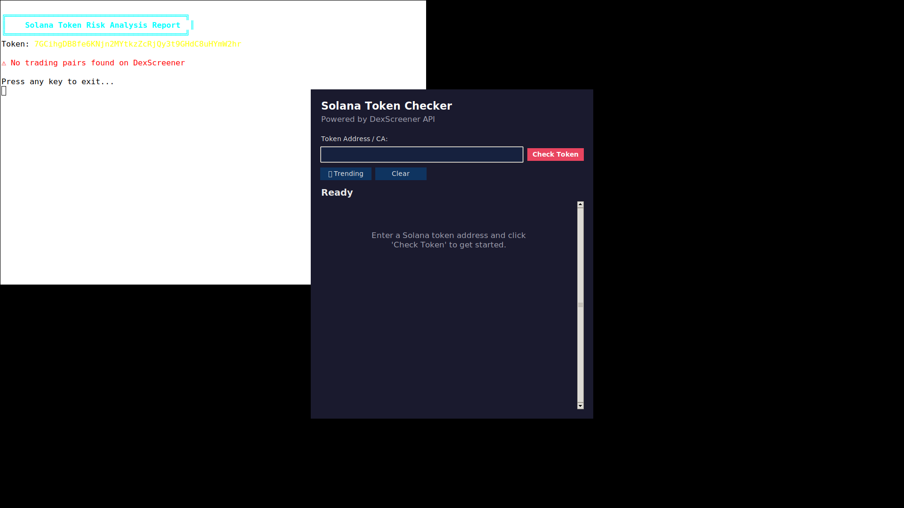

# Solana Token Checker GUI

A desktop GUI application for checking Solana token data via the DexScreener API.

Built with **pure Python + tkinter/ttk** — no external dependencies required.



## Features

- 🔍 **Check Token** — Enter any Solana token address and get detailed information
- 🔥 **Trending** — View top Solana tokens sorted by 24h volume
- 🛡️ **Risk Assessment** — Color-coded risk scores (green/yellow/orange/red)
- 💰 **Token Details** — Price, liquidity, 24h volume, FDV, market cap
- 📊 **Transaction Data** — 5m, 1h, 24h buy/sell counts
- 🌙 **Dark Theme** — Clean, modern dark UI
- 🖱️ **Clickable Rows** — Click any trending token to instantly check it

## Requirements

- Python 3.12+
- Python Tkinter (`python3-tk` on Debian/Ubuntu)

## Quick Start

```bash
# Install python3-tk (if needed)
sudo apt install python3-tk

# Run
python3 app.py
```

## API

Uses [DexScreener API](https://docs.dexscreener.com/api/reference) for on-chain token data.

## License

MIT
